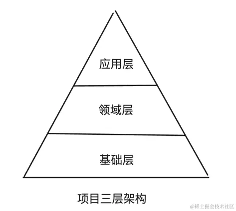

# Best Practices for organizing a clear project structure

如何才能算一个的项目结构？

从文件的增删改查四个维度来分析

- 增：创建文件时不会纠结，一个文件只应该放倒某个特定目录下，不存在二义性
- 删：可以轻松删除一个功能模块，不会和其他模块有过多耦合
- 改/查： 可以快速定位到文件，查找文件应该像访问一个哈希表，可以直接定位到，而不像访问一个链表或者拓扑图，需要反复遍历。

项目结构划分的底层思想
> 编程的方法论，力争发现问题背后的本质，所以会重点讲解一些设计原则和设计思想
> 不针对一个具体问题提出一个具体的解决方案
> 而是分析一个具体的问题，通过分析归纳，找出解决这一类的底层思想、设计原则和方法论。

MECE法则

MECE是Mutually Exclusive，Collectively Exhaustive
> "相互独立，完全穷尽" - 《金字塔原理》

相互独立 Mutually Exclusive
就是当我们对问题进行分解的时候，确保每个层级的问题与问题之间没有重复、交叉或相关性。
完全穷尽 Collectivelly Exhaustive
完全穷尽则是要求所有的子问题或分类加起来必须覆盖整个问题的所有集合。
> 意味着在拆封问题时，不能遗漏任何重要的元素或方面。
> 每个与问题相关的点都应该被纳入某个子问题中，以确保对问题的全面分析
>

二分法
就是找一个角度将事物一分为二
核心是找到一个维度，然后对事物一分为二

- 要素法
- 流程分析法
- 矩阵分析法

> 要素法
> 要素法就是根据事物的属性对其进行分类
>比如按照人的年龄进行分类 婴儿 儿童 青年 壮年 老年
> 流程分析法
> 流程分析法按照事物发展的流程或顺序进行分解，每个步骤都是独立的，所有步骤共同构成完整的流程
> 比如将一个生产加工过程分为原材料采购、生产加工、质检、包装、销售和售后服务
> 开发一个项目可以分为几个流程
> 开发前准备工作 mock build
> 业务开发 src
> 测试 test
> 部署 deployer
> 上线 doc目录
> 矩阵分析法
> 使用矩阵将问题划分不同的象限或区域，每个区域代表一个独立的子问题
> 四象限
> 工作重要和紧急
> 重要紧急、重要但不紧急、紧急但不重要、既不紧急也不重要
>
>

分层思维
通过分层将复杂的软件系统划分为一系列相互独立且功能明确的层次，每个层次都只关心这个层次赋予的职责，从而实现了关注点的分离；
每个层次我们都可以使用MECE原则再分为多个子模块，进一步将一个复杂问题拆解为一些小问题，逐个击破，将很难完成的复杂任务消化掉。

For example
MVC
M表示model 模型 负责数据的存储，检索和更新等操作，模型通常与数据库交互，执行数据的增删改查；
V表示view 视图 负责数据的展示，视图从模型中获得数据，并将其以特定的格式呈现给用户；
C表示 controller 复杂接受用户的输入，然后调用模型获取数据返回给用户或者将用户传来的数据保存到数据库中。

划分前端组件

- 通用组件
- 项目基础组件
- 业务组件
- 页面组件
高层组件可以调用底层组件，底层组件绝对不可以引入高层组件

领域设计驱动 DDD

Domain-driven Design
就是一种以领域专家、设计人员、开发人员都能理解的通用语言作为相互交流的工具，在交流的过程中发现领域概念，然后将这些概念设计成一个领域模型；
由领域模型驱动软件设计，用代码来实现改领域模型；

可以抽象出一套领域层



```js
├── domain         //领域层
│    ├── user          //用户模型
│    │  ├── const          //用户相关的常量配置
│    │  │   ├── api.js         //用户功能涉及的接口配置，如 exports const userAPi = '/api/v1/user'
│    │  │   └── status.js      //用户功能涉及的一些状态常量 exports const UserType = {vip: 1, ordinary:2}
│    │  ├── service.js     //用户的增删改查接口调用方法
│    │  ├── components     //用户涉及的组件
│    │  │   ├── AddUser.vue       //添加用户组件
│    │  │   └── UserAvatar.vue    //用户头像组件
│    │  ├── config.js      //用户涉及的配置
│    │  └── utils.js       //用户涉及的utils工具库
│    └── product       //产品模型
│       ├── const    
│       ├── components 
│       ├── service.js   
│       ├── config.js     
│       └── utils.js
├── src          //应用层
│   └── pages        //页面组件
│       ├── user-list   //页面组件引用基础组件和领域层组件
│       └── user-detail
└── base            //基础层
     └── components    //项目基础组件
        ├── MyTable    //通用table组件
        ├── MyForm     //通用Form组件
        └── MyDialog   //通用弹窗组件       

```

SOLID
SRP signle responsibility principle(单一职责原则)
一个类别只应该有一个职责

```javascript
// 错误示范
class Error_ShoppingCart{
    constructor(){
        this.items = []
        this.total = 0
    }

    add(item){
        this.items.push(item)
        this.total += item.price
    }

    delete(item){
        let index = this.items.findIndex((goods)=> goods.id === item.id)
        if(!~index) return console.log('error')
        this.items.splice(index, 1)
        this.total -= item.print
    }

    print(){

    }
}
// 拆分上述逻辑 一个类别只负责一件事

class ShoppingCart {
    constructor(){
        this.items = []
    }
    add(items){
        this.items.push(item)
    }
    remove(itemId){
        this.items = this.items.filter((item)=> item.id !== itemId)
    }
}

class PriceCalculator {
    static getPrice(items){
        return item.reduce((sum,item)=> sum + item.price,0)
    }
}

class CartPresenter{
    static log(cart){
        return 
    }
    
}
```

open-closed Principle(开放封闭原则)
软件实体应该对扩展开放，对修改封闭
拓展实体，而非修改。

```javascript
class ErrorShoppingCart {
    constructor(){
        this.items = []
    }

    add(items){
        this.items.push(item)
    }
    remove(itemId){
        this.items = this.items.filter((item)=> item.id !== itemId)
    }
    get getPrice(){
        return this.items.reduce((sum,item)=> sum += item.price,0)
    }
    get  totalPrice(){
        return this.getPrice()
    }
    get  totalPrice90(){
        return this.getPrice() * 0.9
    }

    ...

}
// 打9折 这些怎么办

cosnt discountStrategies = {
    none:(price) => price,
    standard90:(price) => price * 0.9,
    vip80:(price) => price * 0.8,
    fullReduction:(price) => price > 100 ?  price -20 : price,
}

class ShoppingCart {
    constructor(discount: discountStrategies.none){
        this.items = []
        this.discount =  discount
    }

    add(items){
        this.items.push(item)
    }
    remove(itemId){
        this.items = this.items.filter((item)=> item.id !== itemId)
    }
    get getPrice(){
        return this.items.reduce((sum,item)=> sum += item.price,0)
    }
    get  totalPrice(){
        return this.discount(this.getPrice())
    }
}
```

LSP(里氏替换原则) Liskov subsititution Principle

所用引用基类别的地方必须能够透明地使用其子类别的对象
> 子类别应该可以替换其父类别并且不会破坏系统的正确性
> 子类应该有基类的一切特点
> 行为设计，父类的每一个行为，子类是否都能以完全相同的方式完成，如果子类需要改变，即不符合 liskov subsititution principle 原则
> 契约约束，即父类的限制，子类不能进行修改
> [LSP](https://zhuanlan.zhihu.com/p/268574641)

```javascript
class Shape {
    area(){
        throw new Error("需要实现此方法");
    }
}
class Rectangle extends Shape{
    constructor(width,height){
        this.width = width
        this.height = height
    }
    set_height(height){
        this.height = height
    }
    set_width(width){
         this.width = width
    }
    area(){
        return this.width * this.height
    }
}
// 不应该继承Rectangle  extends Rectangle(error)
class Square extends Shape{
     constructor(width,height){
        super()
        this.width = width
        this.height = height
    }
    set_height(height){
        this.width = height
        this.height = height
    }
    set_width(width){
        this.height= width
         this.width = width
    }
}
```

ISP(介面隔离原则) interface Segregation Principle

interface segregation principle
> 客户端不应该被迫依赖于它不使用的接口
> 接口应该被拆分更小更具体的部分
> 多小优于一大
> 高内聚
> 低耦合
> 灵活性

```javascript
class Machine {
    constructor(){

    }
    
    print(){
        console.log('print')
    }

    scan(){
        console.log('scan')
    }

    fax(){
        console.log('fax')
    }
}


class MultiFunctionPrinter extends Machine {
     constructor(){

    }
    
    print(){
        console.log('print')
    }

    scan(){
        console.log('scan')
    }

    fax(){
        console.log('fax')
    }
}

// 1. 定义细粒度的行为（类似于拆分接口）
const canPrint = {
    print() { console.log('Printing...'); }
};

const canScan = {
    scan() { console.log('Scanning...'); }
};

const canFax = {
    fax() { console.log('Faxing...'); }
};

// 2. 根据需要组合功能
class OldPrinter {
    constructor() {
        // 只具备打印功能
        Object.assign(this, canPrint);
    }
}

class MultiFunctionPrinter {
    constructor() {
        // 具备全套功能
        Object.assign(this, canPrint, canScan, canFax);
    }
}

// 3. 甚至可以创建一个只负责扫码的设备
class Photocopier {
    constructor() {
        Object.assign(this, canPrint, canScan);
    }
}
// interface segregation principle
```

DIP(依赖反转原则) dependency inversion principle
高层模块不应该依赖低层模块，两者都应该依赖于抽象。
通过介面或抽象类别进行交互
何谓高层次模组、何谓低层次模组？ 在软件系统中，我们常会区分系统的不同层次，例如资料存取层、商业逻辑层、介面层等，资料存取层可能包含了一些和资料库沟通的代码，而商业逻辑层则使用资料存取层中提供的方法来操作资料。在这种情况下，商业逻辑层可以被视为高层次模组，因为它使用了低层次模组的服务。

```javascript
class Logger {
    log(str){
        console.log(str)
    }
}

class User{
    constructor(){
        this.logger = new Logger()
    }

    register(username){
      this.logger.log('username:`${username}`')  
    }
}
IOC inversion of control 控制反转
通过转进来的log来控制使用哪种打印方法

// 1. 抽象/契约：在 JS 中虽然没有 interface，但我们通过“鸭子类型”来达成默契
// 只要对象有 log 方法，它就是个好的 Logger

class FileLogger {
    log(str) { console.log(`Writing to file: ${str}`); }
}

class ConsoleLogger {
    log(str) { console.log(`Console: ${str}`); }
}

// 2. 高层模块：不再 new，而是接收注入
class User {
    constructor(logger) {
        // 依赖倒置：User 依赖于传入的抽象对象
        this.logger = logger;
    }

    register(username) {
        this.logger.log(`Registering user: ${username}`);
    }
}

// 3. 在“组装层”决定使用哪种细节
const logger = new ConsoleLogger(); 
const user = new User(logger); // 将具体实现注入进去
user.register('Jack');
```

项目划分

- 就近原则
- 一致原则
就近原则就是把逻辑上相近的资源存放在一起

> 逻辑相近可以理解为 同一个理由需要去修改A和B文件，可以理解为逻辑相近

一致原则

一致原则指的是在整个项目中保持相似的结构和命名约定，以便开发人员能够快速理解项目结构。
通过一致性，可以降低学习成本、提高团队协作效率、并减少出错的可能性。

- 目录和文件名保持一致
- 目录下的内容要和目录名称保持一致
- 命名要和使用方保持一致

## 项目实战

MECE 二分法 可以将项目划分为

- 开发阶段
- 非开发阶段

开发阶段文件

MECE法则：强调在划分目录时既要相互独立，又要完全穷尽，可以通过二分法、要素法、流程分析法和矩阵分析法可实现这个法则。
分层思维：合理的分层可以降低项目的开发难度，解除循环依赖，在设计项目时要通过分层思维对我们的组件、样式等进行层次划分，定义好每个层次的职责
领域驱动设计DDD：通过增加领域层来组织业务代码是一个很好的实践策略，领域层中每个模块就是业务中的一个具体概念，是一个名词，某个领域的全部资源都应该放到领域模块下。
就近原则：如果因为同一个理由需要修改多个文件，那么这几个文件最好放到一起
一致原则：团队应该制定一个统一的命名规范，同时目录下的文件内容要和目录名保持一致，页面组件的命名要和路由path保持一致
  