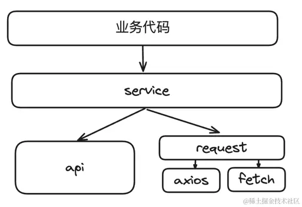

# Best Practices for building a robust api service layer

## 网络请求的问题

```javascript

getUsers(){
    axios.get('/api/v1/users', {
        params: {
            page: 1,
            page_size: 10
        }
    }).then(response =>{
        if(response.status === 200 && response.data.code === 200){
            this.users = response.data.data || []
        }
    }).catch(e =>{
        alert(e.message)
        console.log(e)
    })
}
```

> 这样的问题有那些
> 首先 硬编码了 url地址 不方便以后的修改
> 这样没有隔离变化
> 后端接口变了，所用用到的地方都需要改变
> 调用接口不用写在业务文件中
> 应该抽象出来，只调用方法，不涉及实现
> 隔离变化 不管前端的变化还是后端的变化都应该收敛

- url地址采取了硬编码形式访问
- 请求成功的处理逻辑会存在重复
- 请求失败的处理逻辑会存在重复，失败逻辑处理不全面
- 不应该将getUsers方法放在某个组件中
- 不应该直接调用axios进行网络请求（可能会有疑问，后面我们会讲）

## 网络请求方法 request的封装


service.js  ---> 封装增删改查，业务组件只能依赖service.js不能直接使用request.js
应用层  ----> 只使用service.js

通过上述的要求开发流程可以规范
● 阅读接口文档 配置api.js 
● 通过api.js 和 request.js来实现这个domain的service.js
● 创建业务组件，调用service.js

```javascript
//数组形式
export const userApis1 = {
   getUsers: ['GET', '/api/v1/users'],
   addUser: ['POST', '/api/v1/user'],
   getUserDetail: ['GET','/api/v1/user/{id}'],
   updateUser: ['PUT', '/api/v1/user/{id}'],
   deleteUser: ['DELETE','/api/v1/user/{id}']
}
//字符串形式
export const userApis = {
   getUsers: 'GET /api/v1/users',
   addUser: 'POST /api/v1/user',
   getUserDetail: 'GET /api/v1/user/{id}',
   updateUser: 'PUT /api/v1/user/{id}',
   deleteUser: 'DELETE /api/v1/user/{id}'
}

```

```javascript
import axios from "axios";

const instance = axios.create();

instance.interceptors.request.use(function (config) {
  if (!config || typeof config.url !== 'string') return config;

  // 幂等保护，防止重复处理
  if (config.__requestProcessed) return config;

  // 1. 解析 METHOD 前缀（若存在）
  const trimmed = config.url.trim();
  const m = trimmed.match(/^(GET|POST|PUT|DELETE|PATCH|HEAD|OPTIONS)\s+(.+)$/i);
  if (m) {
    if (!config.method) config.method = m[1].toLowerCase();
    config.url = m[2];
  }

  // 2. 用 params 替换 path 占位符并从 params 中移除已替换键
  const params = config.params || {};
  // 支持连字符等更宽松的 key：{some-key}
  config.url = config.url.replace(/\{\s*([^\}]+)\s*\}/g, (match, key) => {
    if (Object.prototype.hasOwnProperty.call(params, key)) {
      const value = params[key];
      // 不直接修改传入 params，创建浅拷贝并替换回去
      config.params = { ...params };
      delete config.params[key];
      return encodeURIComponent(value == null ? "" : String(value));
    }
    return match; // 保留未替换占位符
  });

  // 3. 支持取消请求回调（优先使用 AbortController，如果环境/axios 支持）
  if (config.getCancelMethod && typeof config.getCancelMethod === 'function') {
    if (typeof AbortController !== 'undefined') {
      const controller = new AbortController();
      config.signal = controller.signal;
      config.getCancelMethod(controller.abort.bind(controller));
    } else if (axios.CancelToken) {
      config.cancelToken = new axios.CancelToken(function (c) {
        config.getCancelMethod(c);
      });
    }
    // 不再需要该字段
    delete config.getCancelMethod;
  }

  config.__requestProcessed = true;
  return config;
});

return instance

```
```javascript
import userApis from '../api.js'
import request from '../requset.js'
export function getUsers(page = 1, page_size = -1) {
   // 重要的事情说3遍
   //一定要叫request或者network，而不是axios
   //一定要叫request或者network，而不是axios
   //一定要叫request或者network，而不是axios
   return request(userApis.getUsers);
}
```
理想的网络分层
业务层代码只能调用service提供的方法，不能直接引用api或者request方法，更不能直接调用axios等第三方库。

service引用每个服务的api配置和封装的request方法完成网络请求，同样的在service中不能直接调用第三方http库。

request方法由第三方库来实现，可以通过axios或者fetch等任何http库来实现，更换第三方库不会影响其它层。



最小知识原则：对一个功能模块的更改最好不要依赖大量的知识储备，在设计时就要考虑别人怎么用最简单，最好让一个新人就能快速上手。

依赖倒置原则：上层应用不应该依赖底层实现，而是要从甲方的角度去提要求，要关注我们需要什么，怎么用第三库来实现，而不是别人有什么我们用什么。通过依赖倒置原则解除了项目对第三方库（如axios）的依赖，实现了解耦。