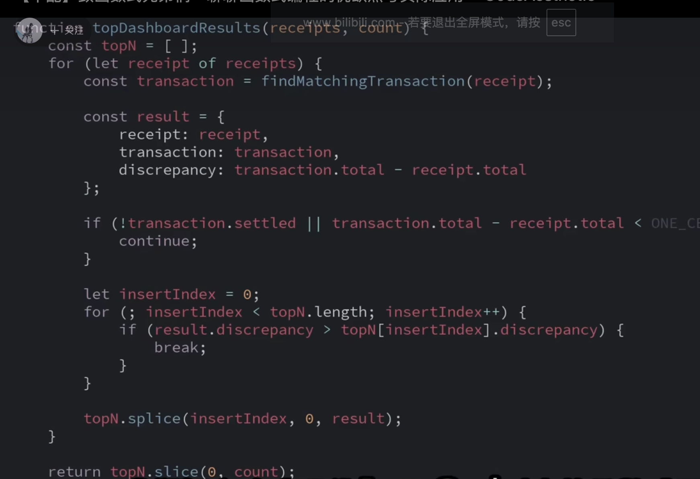

# Best Pracites For OOP

面向过程
就是把事情拆分为一个个流程
for example：
放衣服
放洗衣液
洗
烘干

面向对象
就是将一个过程中每一个参与的都可以当成一个对象

for example：
洗衣服这个事物存在的对象
对象
人
洗衣机

人
放
开机

洗衣机
开关
清洗
烘干

封装
使用者无需知道太多细节

继承
父类可以派生出多个子类

多态
父类的子类可以针对不同参数来实现同一方法，不同实现

模拟真实性质

> 面对过程是编年体，面对对象是纪传体
> 怎么理解这句话？
> frist： 我们要知道什么是编年体？ 什么是纪传体？
> 编年体
> 以时间为核心线索，按照年份，月份的顺序，一件事情接一件事情的记录，他强调的是过程，步骤和先后顺序。
> 第一步做什么，第二步做什么
>
> 记传体
> 特点：以人物为核心 但人物是聚合的。
> 面向对象编程的核心是对象和类，程序是由一群对象组成的。
> 每个对象都有自己的 attribute 和 methods
> 我有什么，我能做什么，谁来找我做事？

一切皆对象

> 面对对象编程(Object-oriented programming) 是一种程序设计范式，它将程序中的数据和操作数据的方法组织成队形，通过对象之间的交互来实现程序的功能。

类(class): 类是面向对象的基础概念，用于描述具有相似属性和行为的对象的模版。

> 类定义对象的属性和行为，是创建对象的蓝图

对象(Object): 对象是类的实例，是具体的数据实体。

> 每个对象都有自己的状态和行为

<!-- basic characteristics -->

object-oriented programming's basic characteristics

1. 抽象
2. 封装
3. 继承
4. 多态

what？
什么是抽象？
抽象就是对现实世界或问题领域的概念进行简化和概括，从而创建出更通用，更易于理解和使用的程序结构。

> 通过抽象，将具有相同的属性和行为的一组实体抽象为类；将这些实体的操作行为抽象为方法；将实体的数据抽象为属性；并将这些实体和外部打交道的属性、方法抽象为接口，从而隐藏内部的实现细节。

什么是封装？
封装是将数据和操作封装在对象中，隐藏对象的内部实现细节，只暴露必要的接口供外部访问。

> 保护对象内部的数据不直接受外部的修改和访问

什么是继承？
继承允许一个类继承另一个类的属性和方法。子类可以重用父类的代码，并可以在其基础上进行扩展和修改。

> 本质是一种复用策略
> 通过多个对象的组合替代继承
>
> inheritance(is-a)
> 继承是白盒继承，就是子类继承了父类的一切特点。
> 脆弱的基类问题 :父类的代码发生了修改，所有的子类的行为都可能受影响
> 打破封装性： 重写父类方法
> 静态决定：
> 不恰当的职责： 背负了不需要的方法
>
> composition(has-a)
> 不是类 a 去继承类 b，而是类 a 里面放一个类 b 的实例对象
> 降低依赖： 组合类只依赖于被组合对象的公开接口，而不关心它的内部实现
> 灵活性高：运行时建立关系，动态的替换对象的行为
> 颗粒控制：你可以选择选择你需要那几个方法

什么是多态？
多态是指同一个方法可以根据对象的不同类型表现出不同行为。
通过多态，可以提高代码的灵活性和可拓展性。

抽象和封装可以组成类
继承和多态可以让类多样性和复用性

编程范式(programming paradigms)

> 思想和方法论，用于知道程序员在解决问题时的思考方式和代码组织方式
> 不同的编程范式强调不同的概念和技术
> 面对过程：强调的是过程和函数的顺序执行。
> 面对对象：强度过程的封装和继承。
> 函数式编程：强调函数的纯粹性和不可变性。

命令式编程：通过一系列的命令或语句来描述程序的执行步骤。在命令式编程中，程序员需要明确地指定程序的每个细节，包括数据的存储，计算的顺序以及控制流程。

面向过程编程：以过程或函数为基本单位，通过顺序执行一系列操作来解决问题

函数式编程：将技术视为函数的求值过程，函数被视为一等公民，函数可以作为参数传递给其他函数，也可以作为返回值返回；强调函数的纯粹性和不可变性，避免副作用。

前端开发 菜单高亮

```javascript
// imperative programmming

const imperativeProgrammingMenu = [
  {
    label: "用户管理",
    index: "user",
  },
  {
    label: "订单管理",
    index: "order",
  },
  {
    label: "统计分析",
    index: "statistic",
  },
];

const activeMenu = null;

let currentPath = "user";
for (let i = 0; i < imperativeProgammingMenu.length; i++) {
  let item = imperativeProgammingMenu[i];
  if (item.index === currentPath) {
    activeMenu = item;
    break;
  }
}

console.log(activeMenu);

// 面对过程 process-oriented progamming
function getActiveMenuItem(menu, currentPath) {
  return menu.find((item) => item.index === currentPath);
}

console.log(getActiveMenuItem(imperativeProgrammingMenu, "user"));

// 函数式编程
console.log(imperativeProgrammingMenu.find((item) => item.index === "user"));
```

what？
什么是函数式编程？


object-oriented progamming
面对对象编程

```javascript
class Menu {
  constructor(menu) {
    this.menu = menu;
  }
  getActiveItem(currentPath) {
    return this.menu.find((item) => item.index === currentPath);
  }
  getSubMenu(parentPath) {
    let activeMenu = this.getActiveMenu(parentPath);
    return (activeMenu && activeMenu.children) || [];
  }
}
```

面对对象编程优势
- 有数据有方法
- 复用性更强
