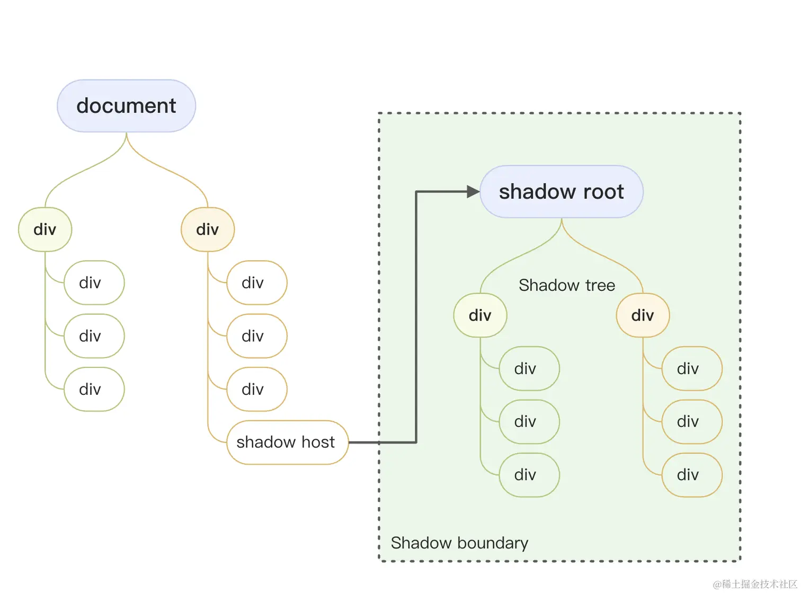

# what is web Components?

指一系列加入W3C的HTML與dom的特性

- 原生層面實現組件化
- 沒有任何依賴，只需瀏覽器內核實現W3C標準
  
## 3個核心API

### Custom Elements

1. 自定義元素挂载方法
自定義元素

```javascript
class HelloWorld extends HTMLElement {
    constructor() {
        super()
        this.attachShadow({ mode: 'open' })
        this.shadowRoot.innerHTML = `
        <style>
        :host{
        display: block;
        padding: 10px;
        background-color: #eee;
        }
        </style>
        <h1>
        hello world！
        </h1>
        `
    }
}

window.customElements.define('hello world', HelloWorld)

// HTML  <hello-world></hello-world>
```

2.自定义元素的类(HTMLElement)
3.自定义元素的生命周期
>
>1. connectedCallback 被渲染时触发
>2. disconnectedCallback 被移除时触发
>3. adoptedCallback 移动到新文档时触发
>4. attributeChangedCallback 属性被改变后触发

4.自定义方法

就是初始类上的methods

? 修改shadow root 为什么不会触发钩子 attributeChangedCallback why？

### Shadow Dom

dom树的操作 ---> 隔离操作

影子DOM就是用来隔离自定义元素不受到外界样式，或者一些sied effect的影响
内部特性不会影响外部

组件使用shadow Dom --> shadow host --> shadow DOM ---> shadow tree


作用

- 隔离样式污染

? 为什么开shadow host js文件可以放在开头呢？

### HTML Template

```javascript
js
class HelloWorld extends HTMLElement {
    constructor() {
        super()
        // 不开启 shadow hostr
        const shadowRoot = this.attachShadow({ mode: 'open' })

        // const div = document.createElement('div')
        // const style = document.createElement('style')
        // style.innerHTML = `h1 {
        //                     display: block;
        //                     padding: 10px;
        //                     background-color: #eee;
        //                 }`
        // div.innerHTML = `
        //             <h1>Hello World! 自定义组件内部</h1>
        //         `;
        // this.appendChild(style);
        // this.appendChild(div);
        // this.shadowRoot.innerHTML = `
        // <style>
        // :host{
        // display: block;
        // padding: 10px;
        // background-color: #eee;
        // }
        // h1{
        // color: red;
        // }
        // </style>
        // <h1>
        // hello world！
        // </h1>
        // `
        shadowRoot.appendChild(document.getElementById('hw').content.cloneNode(true));
    }
    // 1. 当自定义元素首次被渲染到文档时间调用
    connectedCallback() {
        console.log('1111')
    }
    //  2. 当自定义元素首次被渲染到文档时间调用
    disconnectedCallback() {
        console.log('baybay')
    }
    // 3. 当自定义元素被移动到新的文档时调用
    adoptedCallback() {

    }
    // 4. 当自定义元素的属性更改时调用
    attributeChangedCallback() {
        console.log('changed',)
    }

    say(something) {
        console.log('This is hello-world tag.')
    }
}

window.customElements.define('hello-world', HelloWorld)

// html
 <template id="hw">
        <style>
            h1 {
                color: blueviolet;
            }
        </style>

        <h1>template</h1>
    </template>
```

## Stencil

Stencil is a library for building reusable. scalable component libraries.
Generate small,blazing fasr web Componets that run everywhere